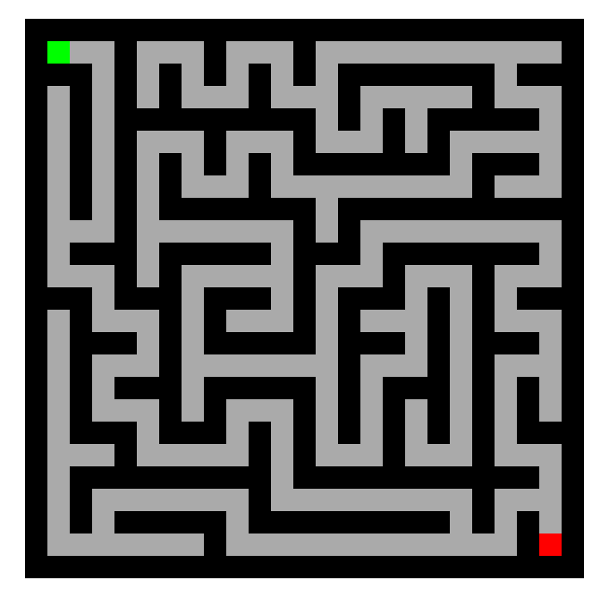

# Maze Solver

**Número da Lista**: X 
**Conteúdo da Disciplina**: Grafos 2 

## Alunos
|Matrícula | Aluno |
| -- | -- |
| 18/0062760  |  Bruno Bernardes Duarte |

## Sobre 
O projeto é um complemento ao [Projeto de Grafos 1](https://github.com/projeto-de-algoritmos/Grafos1_maze-solver). Anteriormente o usuário precisava desenhar o labirinto clicando e arrastando o mouse,
agora basta clicar em um botão que um labirinto será gerado através de uma versão randomizada do algoritmo de Prim.

## Screenshots

## Instalação 
**Linguagem**: Javascript 
[Disponível Aqui !](https://projeto-de-algoritmos.github.io/Grafos2_maze-generator/)
## Uso 
Clique no botão "Generate" para gerar o labirinto, escolha entre "Breadth First Search" e "Depth First Search" e depois clique no botão "Solve".

